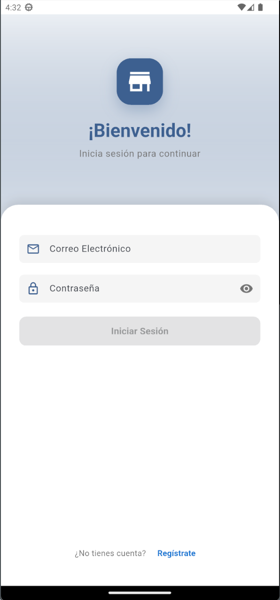
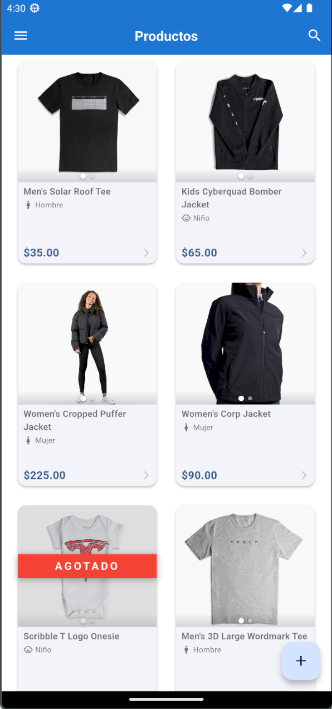
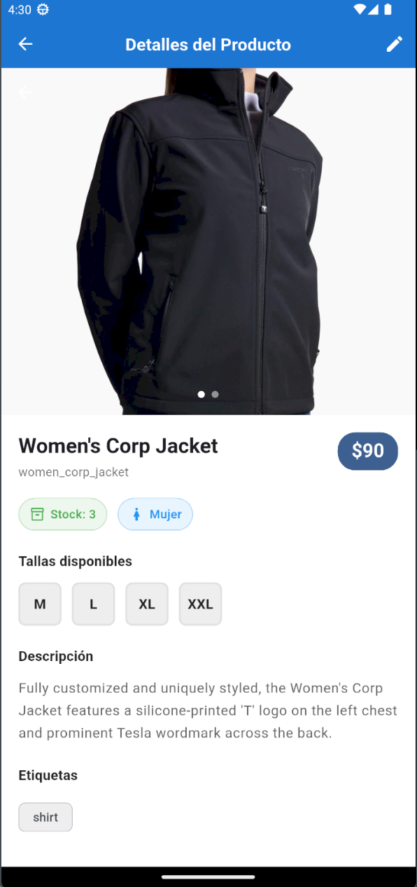
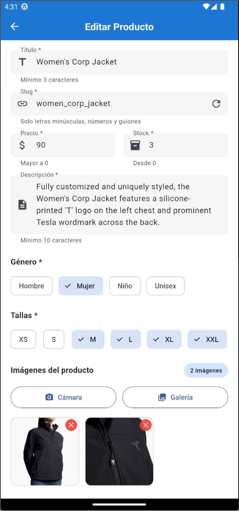

# 🛍️ Teslo App

Aplicación móvil de e-commerce construida con Flutter, implementando Clean Architecture y gestión de estado con Riverpod.

## 📱 Vista Previa de la Aplicación

<div align="left">
  
  
  
  
</div>

## 🧾 Tabla de Contenidos

- [Características](#-características)
- [Arquitectura](#-arquitectura)
- [Tecnologías](#-tecnologías)
- [Requisitos Previos](#-requisitos-previos)
- [Instalación](#-instalación)
- [Configuración](#-configuración)
- [Estructura del Proyecto](#-estructura-del-proyecto)
- [Funcionalidades](#-funcionalidades)
- [Comandos Útiles](#️-comandos-útiles)
- [Guías de Desarrollo](#-guías-de-desarrollo)

## ✨ Características

- 🔐 **Autenticación completa** (Login/Registro/Logout)
- 📦 **Gestión de productos** con listado y detalles
- 🎨 **UI/UX moderna** con Material Design
- 🔄 **Gestión de estado** con Riverpod
- 🌐 **Comunicación HTTP** con Dio
- 📱 **Navegación declarativa** con GoRouter
- 🏗️ **Clean Architecture** (Domain, Data, Presentation)
- ✅ **Validación de formularios** en español
- 🎭 **Manejo de errores** centralizado
- 🔒 **Variables de entorno** seguras

## 🏛️ Arquitectura

El proyecto implementa **Clean Architecture** con la siguiente estructura de capas:

```
lib/
├── domain/          # Entidades y repositorios (contratos)
├── data/            # Implementaciones, datasources y mappers
└── presentation/    # UI, providers y widgets
```

### Capas

- **Domain**: Entidades del negocio y contratos de repositorios
- **Data**: Implementación de repositorios, fuentes de datos y mappers
- **Presentation**: Pantallas, widgets, providers y lógica de UI

## 🛠️ Tecnologías

### Dependencias principales

| Paquete | Versión | Propósito |
|---------|---------|-----------|
| `flutter_riverpod` | ^2.6.1 | Gestión de estado |
| `go_router` | ^16.0.0 | Navegación declarativa |
| `dio` | ^5.8.0+1 | Cliente HTTP |
| `flutter_dotenv` | ^5.2.1 | Variables de entorno |
| `form_validator` | ^2.1.1 | Validación de formularios |
| `intl` | ^0.20.2 | Internacionalización |

## 📦 Requisitos Previos

- **Flutter SDK**: ^3.8.0
- **Dart SDK**: ^3.8.0
- **Backend API**: Servidor REST corriendo (ver configuración)
- **Editor**: VS Code o Android Studio recomendado

## 🚀 Instalación

### 1. Clonar el repositorio

```bash
git clone <repository-url>
cd teslo_app
```

### 2. Instalar dependencias

```bash
flutter pub get
```

### 3. Verificar instalación

```bash
flutter doctor
```

## ⚙️ Configuración

### Variables de Entorno

1. **Crear archivo `.env`** en la raíz del proyecto:

```bash
# Windows (PowerShell)
New-Item .env

# macOS/Linux
touch .env
```

2. **Configurar la URL del API** (basado en `.env.example`):

```env
API_URL=http://localhost:3000/api
```

> **Nota**: Si usas un emulador de Android, reemplaza `localhost` con `10.0.2.2`. Para dispositivos físicos, usa la IP de tu computadora.

### Credenciales de prueba

Para probar la aplicación, puedes usar:

```
Email: test@test.com
Password: 123456
```

## 📁 Estructura del Proyecto

```
lib/
├── config/
│   ├── constants/       # Constantes globales (URLs, etc.)
│   ├── router/          # Configuración de rutas (GoRouter)
│   └── theme/           # Tema de la aplicación
├── core/
│   └── utils/           # Utilidades compartidas
├── data/
│   ├── datasources/     # Fuentes de datos (APIs, DB)
│   ├── errors/          # Definición de errores
│   ├── mappers/         # Conversión entre modelos y entidades
│   ├── models/          # Modelos de datos (DTOs)
│   └── repositories/    # Implementación de repositorios
├── domain/
│   ├── entities/        # Entidades del dominio
│   └── repositories/    # Contratos de repositorios
├── presentation/
│   ├── features/        # Pantallas por funcionalidad
│   │   ├── auth/        # Login, Register
│   │   └── products/    # Listado de productos
│   ├── providers/       # Providers de Riverpod
│   └── shared/          # Widgets compartidos
└── main.dart            # Punto de entrada
```

## 🎯 Funcionalidades

### Autenticación

- ✅ Inicio de sesión con email/password
- ✅ Registro de nuevos usuarios
- ✅ Cierre de sesión
- ✅ Validación de formularios
- ✅ Manejo de errores de autenticación
- ✅ Navegación automática según estado de autenticación

### Productos

- ✅ Listado de productos
- ✅ Menú lateral de navegación
- ✅ Navegación entre pantallas

### Estado y Navegación

- ✅ Gestión de estado con Riverpod
- ✅ Navegación declarativa con GoRouter
- ✅ Rutas nombradas y protegidas

## ⌨️ Comandos Útiles

### Desarrollo

```bash
# Ejecutar la aplicación
flutter run

# Ejecutar en un dispositivo específico
flutter run -d <device-id>

# Modo release
flutter run --release
```

### Análisis y Formato

```bash
# Analizar el código
flutter analyze

# Formatear el código
dart format .

# Aplicar correcciones automáticas
dart fix --apply
```

### Limpieza y Compilación

```bash
# Limpiar temporales
flutter clean

# Reinstalar dependencias
flutter pub get

# Actualizar dependencias
flutter pub upgrade
```

### Testing

```bash
# Ejecutar tests
flutter test

# Ejecutar tests con coverage
flutter test --coverage
```

## 🗺️ Guías de Desarrollo

### Configuración de Linter

Para usar **comillas simples** en lugar de dobles:

1. Editar `analysis_options.yaml`:

```yaml
include: package:flutter_lints/flutter.yaml

linter:
  rules:
    prefer_single_quotes: true
```

2. Aplicar cambios:

```bash
flutter analyze
dart fix --apply
```

### Agregar nuevas dependencias

```bash
# Agregar dependencia
flutter pub add <package_name>

# Agregar dependencia de desarrollo
flutter pub add --dev <package_name>
```

### Gestión de Estado con Riverpod

```dart
// 1. Definir un provider
final myProvider = StateNotifierProvider<MyNotifier, MyState>((ref) {
  return MyNotifier();
});

// 2. Consumir en un ConsumerWidget
class MyWidget extends ConsumerWidget {
  @override
  Widget build(BuildContext context, WidgetRef ref) {
    final state = ref.watch(myProvider);
    return Text(state.value);
  }
}

// 3. Modificar el estado
ref.read(myProvider.notifier).updateValue();
```

### Navegación con GoRouter

```dart
// Navegar a una ruta nombrada
context.goNamed('products');

// Navegar con parámetros
context.goNamed('product-detail', pathParameters: {'id': '123'});

// Volver atrás
context.pop();
```

## 🔧 Solución de Problemas

### Error de conexión al backend

Si recibes `Connection refused`:

1. Verifica que el backend esté ejecutándose
2. Comprueba la URL en `.env`
3. Para Android emulator, usa `10.0.2.2` en lugar de `localhost`
4. Para dispositivo físico, usa la IP de tu computadora

### Error con variables de entorno

```bash
# Verificar que el archivo .env exista
ls .env

# Verificar que esté en pubspec.yaml
flutter:
  assets:
    - .env
```

## 📄 Licencia

Este proyecto es parte de un curso educativo de Flutter.

---

**Desarrollado con** ❤️ **usando Flutter**
